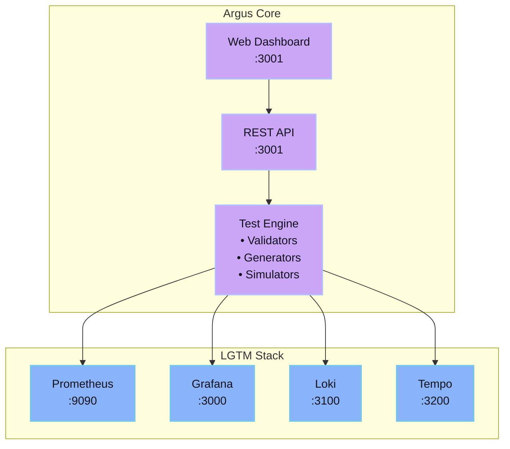
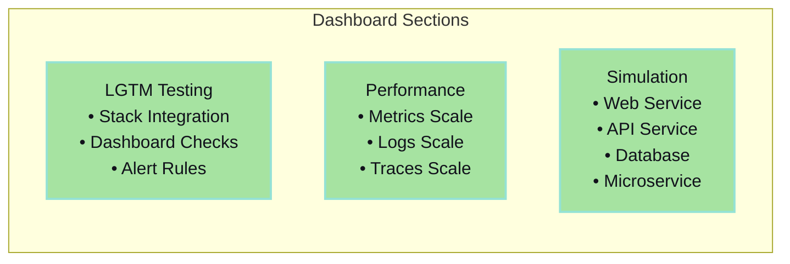
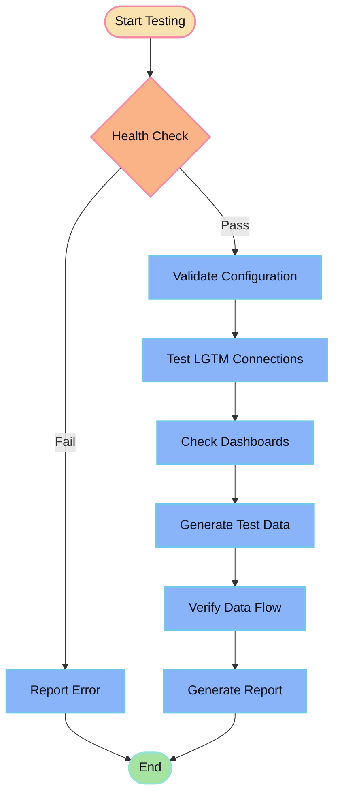

# Argus - LGTM Stack Validator

<div align="center">

**The All-Seeing LGTM Stack Testing Tool**

[](https://github.com/nahuelsantos/argus)
[](https://golang.org)
[](https://opensource.org/licenses/MIT)

</div>

## What is Argus?

Argus validates and tests **LGTM** (Loki, Grafana, Tempo, Prometheus) observability stacks. Named after the Greek giant with a hundred eyes, Argus monitors your infrastructure to ensure everything works correctly.

**Core Purpose:**
- Validate LGTM stack configuration and connectivity
- Generate synthetic metrics, logs, traces, and errors
- Simulate production workloads and traffic patterns
- Test monitoring scenarios and alerting

## Architecture



## Quick Start

### Using Docker
```bash
# Run Argus
docker run -p 3001:3001 ghcr.io/nahuelsantos/argus:latest

# Access dashboard (replace localhost with your server IP)
open http://localhost:3001
```

### Using Make
```bash
git clone https://github.com/nahuelsantos/argus.git
cd argus
make docker-test  # Build, run, and test
```

## Features

### LGTM Stack Testing
- Integration validation and health checks
- Component connectivity verification
- Dashboard availability testing
- Alert rule validation

### Data Generation
- Prometheus metrics with realistic patterns
- Structured and unstructured logs for Loki
- Distributed traces for Tempo
- Controlled error scenarios

### Workload Simulation
- Web service traffic patterns
- REST API simulation
- Database workload patterns
- Microservice communication

## Web Dashboard

Access the dashboard at `http://your-server-ip:3001`:



## API Endpoints

### Core Testing
- `GET /health` - Service health check
- `GET /test-lgtm-integration` - Complete LGTM validation
- `GET /test-grafana-dashboards` - Dashboard testing
- `GET /test-alert-rules` - Alert verification

### Data Generation
- `GET /generate-metrics` - Prometheus metrics
- `GET /generate-logs` - Loki logs
- `GET /generate-error` - Error scenarios
- `GET /cpu-load` - CPU stress test
- `GET /memory-load` - Memory stress test

### Simulation
- `GET /simulate/web-service` - Web traffic patterns
- `GET /simulate/api-service` - API simulation
- `GET /simulate/database-service` - Database workloads
- `GET /simulate/microservice` - Service mesh patterns

## Configuration

### Environment Variables

```bash
# Core Configuration
ARGUS_ENVIRONMENT=development
ARGUS_VERSION=v0.0.1

# LGTM Stack URLs (replace localhost with your server IP)
ARGUS_GRAFANA_URL=http://dinky:3000
ARGUS_PROMETHEUS_URL=http://dinky:9090
ARGUS_LOKI_URL=http://dinky:3100
ARGUS_TEMPO_URL=http://dinky:3200

# Credentials
ARGUS_GRAFANA_USERNAME=admin
ARGUS_GRAFANA_PASSWORD=admin
```

Copy `.env.example` to `.env` and customize for your environment.

## Testing Flow



## Use Cases

### DevOps Engineers
- Pre-deployment monitoring validation
- Infrastructure change verification
- Capacity planning and performance testing

### Platform Teams
- Multi-tenant monitoring validation
- SLA verification and compliance
- Environment parity testing

### Site Reliability Engineers
- Chaos engineering scenarios
- Alert tuning and validation
- Incident response testing

## Development

```bash
# Clone and setup
git clone https://github.com/nahuelsantos/argus.git
cd argus
go mod download

# Run tests
make test

# Build and run
make build
make run

# Docker workflow
make docker-build
make docker-run
make docker-test
```

## License

MIT License - see [LICENSE](LICENSE) file for details.

## Related Projects

- [Prometheus](https://prometheus.io/) - Metrics and alerting
- [Grafana](https://grafana.com/) - Visualization platform
- [Loki](https://grafana.com/oss/loki/) - Log aggregation
- [Tempo](https://grafana.com/oss/tempo/) - Distributed tracing

---

<div align="center">

**Built for the LGTM community**

*"With a hundred eyes, Argus sees all"*

Icons from [Pixel Icon Library](https://pixeliconlibrary.com/) by HackerNoon

</div> 